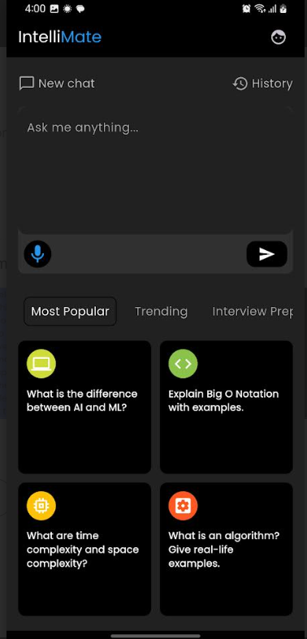

<p align="center">
  
</p>

<style>
  .blue-text {
    color:#267DC0
 ;
  }
</style>

<h1 align="center">
  Intelli<span class="blue-text">Mate</span>
</h1>

A smart and interactive _AI chatbot app_ built using **Flutter**, powered by the **Google Gemini API**. Designed for Computer Science students and enthusiasts, this app lets you ask questions and get intelligent responses from an AI model in real-time.

---

## 📝 Description

**IntelliMate** is a modern Flutter-based chat application that integrates with Google's Gemini AI to provide users with instant, conversational responses. The app features:

- ✅ Real-time typing effect using `AnimatedTextKit
- ✅ Dark blueish UI theme
- ✅ Predefined question suggestions based on user category (e.g., Computer Science)

This project is ideal for developers looking to integrate AI models like Gemini into their apps or build educational tools powered by LLMs.

---

## 📸 UI Preview

To help users and contributors understand how **IntelliMate** looks and feels, you can add screenshots of the app in action.

| Screen              | Description                                              |
| ------------------- | -------------------------------------------------------- |
| 🔐 Login Screen     |    |
| 🚀 Splash Screen    |  |
| 🏠 Dashboard Screen |          |
| 💬 Chat Screen      |      |

---

## 🧰 Technologies Used

| Tool           | Purpose                                  |
| -------------- | ---------------------------------------- |
| Flutter        | Cross-platform UI framework              |
| Dart           | Programming language                     |
| Provider       | State management                         |
| flutter_dotenv | Securely load API keys                   |
| http           | Optional future support for backend APIs |

---

## 🧪 Features

### 💬 Chat Interface

- Ask any question to Gemini AI
- Get live streaming response (like ChatGPT)
- Send message via keyboard or tap

### 🤖 Gemini AI Integration

- Powered by `gemini-1.5-flash` and `gemini-1.5-pro` models
- Supports text and image input (vision mode)

**Available models**:

- `gemini-1.5-flash`
- `gemini-1.5-pro`
- `gemini-pro` _(older)_

### 📚 Quick Questions

- Preloaded set of CS-related prompts grouped by topic:
  - Most Popular
  - Trending
  - Interview Prep
- Tap to send directly to Gemini

### 🎨 UI/UX

- Dark purple-themed UI
- Consistent styling across screens
- Typing animation for assistant replies
- Copy-to-clipboard feature

---

## 📁 Folder Structure

```
lib/
├── main.dart
├── data/remote/
│   ├── api_helper.dart
│   └── urls.dart
|
├── model/
│   ├── gemini_response_model.dart
│   └── message_model.dart
|
├── provider/
│   └── msg_provider.dart
|
├── screen/
│   ├── chat_screen.dart
│   ├── dashboard_screen.dart
│   ├── signup_screen.dart
│   └── splash_screen.dart
|
└── utils/
    ├── app_constant.dart
    └── colors.dart

```

---

## 🛠️ Setup Instructions

### 1. Clone the Project

```bash
git https://github.com/ahmedyar7/IntelliMate.git
cd IntelliMate
```

### 2. Install Dependencies

```bash
flutter pub get
```

> **📌 NOTE:**  
> Make sure you're using the Flutter stable channel:
>
> ```bash
> flutter channel stable
> flutter upgrade
> ```

### 3. Set Up Your Gemini API Key

Create a `.env` file at the root of your project:

```
GEMINI_API_KEY=your_api_key_here
```

Then run:

```bash
flutter pub add flutter_dotenv
flutter pub run dotenv:main
```

Make sure to call `await dotenv.load(fileName: ".env")` in `main.dart`.

### 4. Run the App

```bash
flutter run
```

---

## 🤝 Contributions

We welcome contributions from the community! Whether you're fixing a bug, improving documentation, or adding new features, your help is greatly appreciated.

### ✅ How to Contribute

1. **Fork** the repository
2. **Create a new branch**: `git checkout -b feature/your-feature-name`
3. **Make your changes**
4. **Commit and push** your changes
5. **Open a Pull Request** with a clear description of what you did

# LICENSE

[General-Public-License](./LICENSE)
